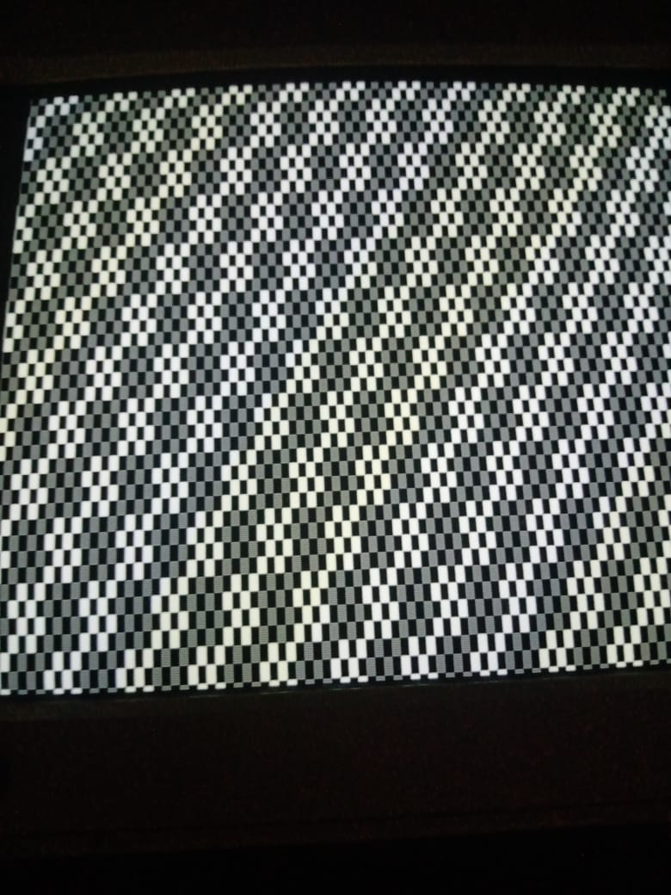
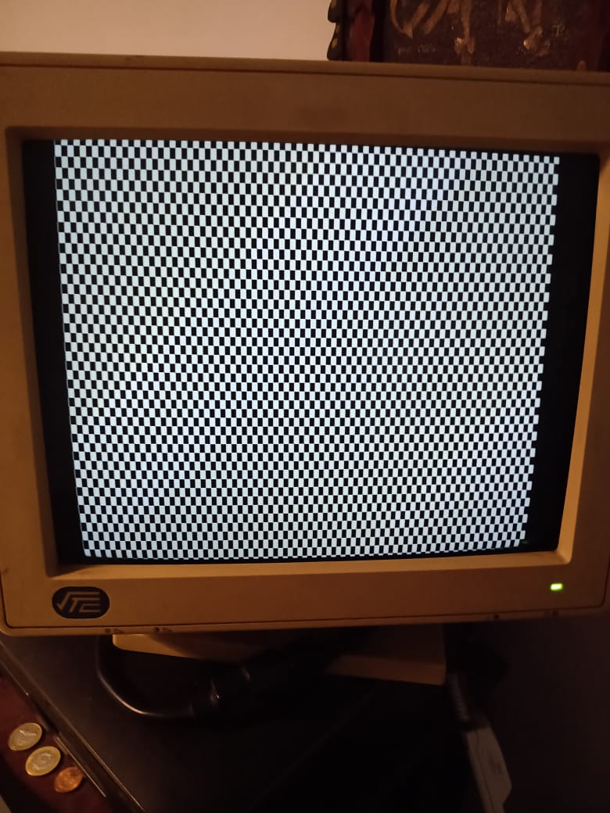
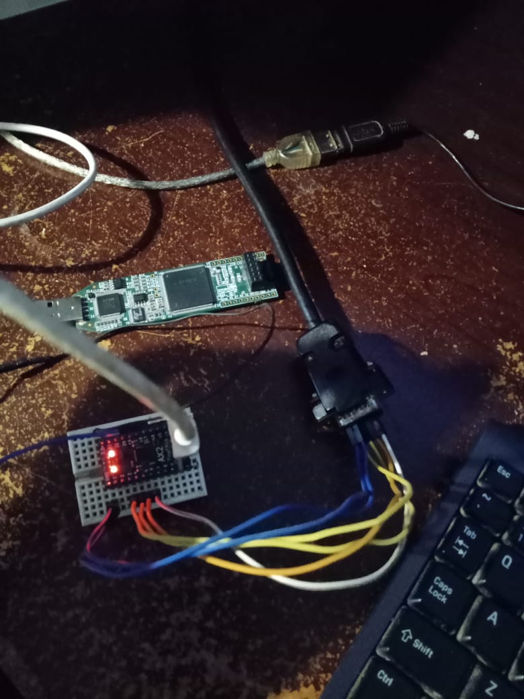

# fpga-vt52-ax2
vt52-fpga-ax2 is an attempt to port
[vt52-fpga](https://github.com/AndresNavarro82/vt52-fpga) to
the [TinyFPGA AX2 Board](https://tinyfpga.com/).

The project is at a very preliminary stage, it'll progress as features
are added to the toolchain and I have the chance to test them out.

## Screenshots

## Toolchain
In order to try this you will need a TinyFPGA AX2 board & the
experimental open-source toolchain for MachXO2 by William Jones, [see
here](https://github.com/cr1901/nextpnr/tree/machxo2/machxo2)
nextpnr-machxo2 should be in your path and then just run build.sh in
order to build and upload the project to the AX2.

## Connections
I'll try to add some schematics later, but basically I'm driving
everything with 3.3V directly from the FPGA. Right now it's just the
onboard led on pin1, and the MDA outputs (intensity, video, hsync &
vsync) in pins 3, 4, 5 & 6.

## Current Status Limitations
I just have a checkerboard pattern on the mda display for now.

## What's next
We still don't have block ROM/RAM in the toolchain so text generation
is out for now.  Serial communication and rudimentary PS/2 input
should be possible (no extensive ROM tables).

## Dependencies
- Build tools:
  [Yosys+prjtrellis+nextpnr+tinyprog](https://github.com/cr1901/nextpnr/tree/machxo2/machxo2)

## License
vt52-fpga-ax2 is free software licensed under the GPLv3 or later. See
LICENSE for details.
